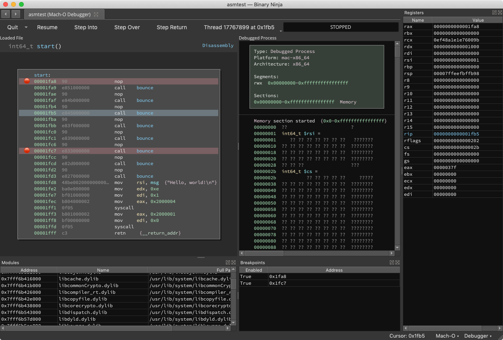
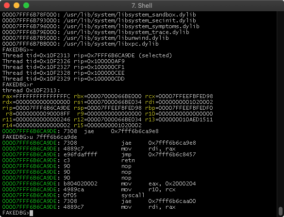

# Debugger Plugin (v0.1-alpha)

Author: **Vector35 Inc**
_Debugger plugin allows Windows, Linux, and Mac binaries to be debugged from within Binary Ninja.

## Description

This plugin adds a new Debugger binary view which gives the user options to execute and debug the current target.

## Screenshots

## Installation Instructions

To install this manually, please see the "Using Plugins" section of the [Getting Started Guide](https://docs.binary.ninja/getting-started.html#using-plugins). Or use Binary Ninja's built in plugin manager.

### Windows

(none)

### Linux

(none)

### Darwin

(none)

## Minimum Version

This plugin requires the following minimum version of Binary Ninja:

* 1.3.2015

## Required Dependencies

* Windows debugging relies on the dbgeng dll's which should be present in default installations.
* Linux needs gdbserver in path.
* MacOS needs debugserver in path or in its default Xcode location: `/Library/Developer/CommandLineTools/Library/PrivateFrameworks/LLDB.framework/Versions/A/Resources/`

## License

This plugin is released under a MIT license.

## Metadata Version

2

## Developers

See [DEVNOTES.md](./DEVNOTES.md).
