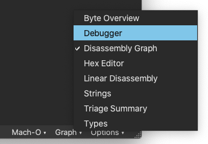
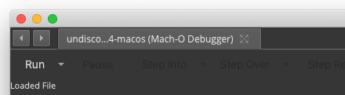
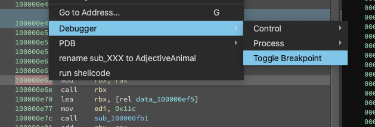
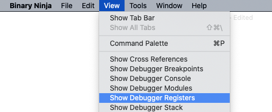
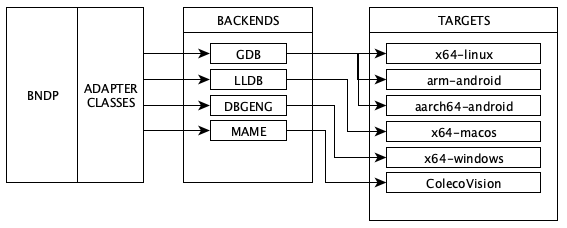

# Binary Ninja Debugger Manual

[toc]
# Introduction

Binary Ninja Debugger Plugin (BNDP) is a plugin for Binary Ninja implementing debug functionality. It can be used from within the GUI or outside (headless). It officially supports 64-bit Windows, Linux, and MacOS targets. Its extensible design makes it easily adapted to other platforms.

# Installation

Please refer to the "Installation Instructions" section from `BNDP_ROOT/README.md`.

# Usage

## GUI Mode

Open a target binary in Binary Ninja. At the lower right, click the view type (here: `Graph`) to raise a context menu that allows you to select `Debugger`:



A view with debugger-related menu items will appear:



Click the dropdown menu arrow near `Run` for additional settings. Click `Run` to execute the target. The other buttons will activate if the target is initialized successfully. Buttons `Resume`, `Step Into`, etc. work as expected. To set a breakpoint, select an address, right click, choose Debugger, then `Toggle Breakpoint`.



The same step is used to clear the breakpoint. To view modules, registers, etc. select `View` from the applicatation's main menu and then the desired view:



## Headless Mode

The API attempts to hide target details behing a uniform interface called DebugAdapter. Start by importing the parent DebugAdapter and the appropriate child for your platform and creating an instance:

```python
from debugger import DebugAdapter, lldb
adapter = lldb.DebugAdapterLLDB()
```

The adapter is not yet associated with any target. To acquire a target, there are functions `exec()`, `attach()`, and `connect()`. Here is a call to execute:

```python
adapter.exec("/path/to/target", ['-param0', 'value0'])
```

Now you may call adapter methods. For target information there are `target_arch()`, `target_path()`, `target_pid()`, `target_base()`. For dealing with registers there are `reg_read()`, `reg_write()`, etc. For breakpoints there are `breakpoint_set()`, `breakpoint_clear()`. See DebugAdapter.py for the full list. Here is an example that uses the API to advance to function MD5Init():

```python
adapt.breakpoint_set(MD5Init)
(reason, data) = adapt.go()
assert reason == DebugAdapter.STOP_REASON.BREAKPOINT
assert adapt.reg_read('rip') == MD5Init
adapt.breakpoint_clear(MD5Init)
```

To acquire the values of functions like MD5Init, we anticipate you wanting to pair headless debugging with analysis:

```python
bv = BinaryViewType.get_view_of_file("/path/to/target")
bv.update_analysis_and_wait()
MD5Init = [f.start for f in bv.functions if f.symbol.full_name == 'MD5Init']
```

See `BNDP_ROOT/examples` for headless debugging scripts.
See `BNDP_ROOT/test.py`  for a giant example of headless debugging.
See `BNDP_ROOT/cli.py`  for an interactive console debugger.

## Automated Tests

Enter `BNDP_ROOT/testbins`  and build the test binaries with the appropriate call for your environment:

```
make -f Makefile-linux
make -f Makefile-macos
nmake -f Makefile-win
```

Then execute `BNDP_ROOT/test.py`.

## Platform Specific Considerations

### Android

Get gdbserver onto the phone, pushing both architectures. The servers from NDK version r15c were tested:

```
adb push ~/android-ndk-r15c/prebuilt/android-arm64/gdbserver/gdbserver /data/local/tmp/gdbserver_aarch64
adb push ~/android-ndk-r15c/prebuilt/android-arm/gdbserver/gdbserver /data/local/tmp/gdbserver_armv7
```

Connect your local machine's 31337 to the phone's 31337 with `adb forward tcp:31337 tcp:31337`.

From the phone, run the appropriate gdbserver on the binary, telling it to listen on 31337, eg: `./gdbserver_aarch64 :31337 ./hello_aarch64-android`.

# Internals

## Multiplatform Architecture

BNDP can connect to three backends: gdb, lldb, and dbgeng. The target is decoupled from BNDP in the first two modes, communicating using the [RSP protocol](https://sourceware.org/gdb/current/onlinedocs/gdb/Remote-Protocol.html) over a socket. Theoretically any platform for which a gdbserver exists can be debugged. In dbgeng mode, BNDP is runtime linked to [Windows debugger engine](https://docs.microsoft.com/en-us/windows-hardware/drivers/debugger/introduction) and can debug local binaries.



BNDP is tested on **x64-linux**, **arm-android** and **aarch64-android** binaries in gdb mode, **x64-macos** binaries in lldb mode, and **x64-windows** binaries in dbgeng mode.

You should have success on the 32-bit x86 versions of the above binaries, but they're not as rigorously tested as 64-bit.

## DebugAdapter And Its Subclasses

Each of the adapters is expected to provide some primitive operations, like reading registers, stepping, breakpoints, etc. The comprehensive, but still short, list is the abstract functions in class DebugAdapter in [DebugAdapter.py](https://github.com/Vector35/debugger/blob/master/DebugAdapter.py).

With classes and inheritance, we're able to factor out common behavior among adapters. For instance, GDB and LLDB have much in common, with LLDB speaking [an augmented RSP protocol](https://github.com/llvm-mirror/lldb/blob/master/docs/lldb-gdb-remote.txt). The current class diagram has plenty of room for an additional adapter and its corresponding backend:


Higher level operations like "step over" are provided by some backends (like dbgeng) but not others (like gdb and lldb). For these, the operation is synthesized with primitive operations. "Step over" might involve disassembling to detect call or loop instructions and setting a one-shot breakpoint. "Go up" might involve reading the stack and setting a one-shot breakpoint at the return address.

## DebugProcessView

`DebugProcessView` is a specialized `BinaryView` that reads and writes its memory from the connected `DebugAdapter`. When the adapter is not present, all reads/writes will return `None` to indicate an error. To save on data transfer, `DebugProcessView` caches all reads from the adapter. Whenever the debugger executes instructions or writes data it will call `mark_dirty` on the `DebugProcessView` and clear the cached data.

`DebugProcessView` provides two functions, `local_addr_to_remote` and `remote_addr_to_local` which will translate addresses for use in binaries that are compiled with Position Independent Code. **Local addresses** correspond to the loaded `BinaryView` analysis and **remote addresses** represent addresses in the debugged binary, which may be relocated in PIE executables.

# For Developers

## The DebugAdapter Ideal

The DebugAdapter wants to present a general debug interface, hiding the ideosyncracies of whatever backend it is connected to. Often you will have to "shape" the behavior of the backend to aim for this ideal.

For example, in Windows, setting a breakpoint always succeeds, no matter the address. It's only at the next go/step/step that bad addresses will raise a write exception because that's when the engine actually writes the 0xCC byte. But the designed behavior of `breakpoint_set()` in DebugAdapter is to write immediately, and provide instant response to the caller if the breakpoint wasn't set correctly. So a `WriteProcessMemory()` is used as a probe, and if it succeeds, the adapter pretends the breakpoint is as good as set.

On Windows, `step over` is available from the dbgeng backend, but with gdbserver and debugserver as backends, it is not. To attain this behavior, `step over` is synthesized by setting a temporary breakpoint at the following instruction, which requires analyzing the current instruction for length and branch behavior.

The stubs implemented by gdbserver and debugserver will not step over an address that has a breakpoint. The program counter will remain the same and a breakpoint event will occur. The breakpoint must be temporarily cleared. The MAME stub, however, has no such restriction.

## GDB vs. LLDB

lldb has single reg reads with 'p' packet, but in gdb registers must be read in group with 'g' packet.

lldb can have its registers polled with 'qRegisterInfo' packet, but gdb uses only XML target description.

lldb has single reg writes with 'P' packet, gdb doesn't, and registers must be written in group with 'G' packet.

lldb can list solibs and executable image with 'jGetLoadedDynamicLibrariesInfos' packet, gdb still looks to /proc/pid/maps.

## Debugging the Debugger

### General Tips

Prove functionality first with `BNDP_ROOT/cli.py` then with the GUI.

### Network Monitoring

For gdbserver and debugserver, monitoring packets can be indispensible.

Use tcpdump: `tcpdump -i lo0 -A -s0 'port 31337'`.
Use `./tools/sniffrsp.py` to monitor traffic between you and gdbserver/debugserver.
Use wireshark.

### Executing Backends Manually

`$ debugserver localhost:31337 ./testbins/asmtest`

`$ gdbserver --once --no-startup-with-shell localhost:31337 ./testbins/asmtest`

`mame -v coleco -video soft -cart /path/to/DACMAN.ROM -window -nomax -resolution 560x432 -debugger gdbstub -debug

### Executing Client Manually

Monitoring, then mimicing behavior from working tools is often faster than starting at the docs:

`(lldb) process connect connect://localhost:31337`


